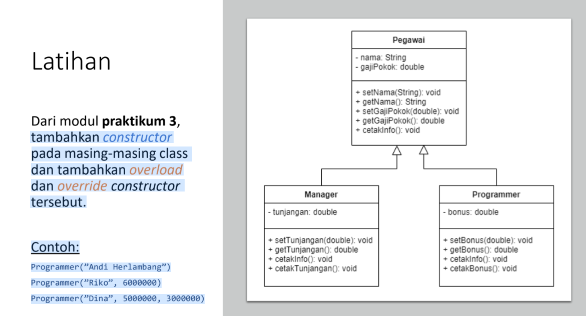
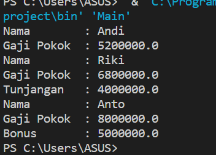

# Praktikum-5

<h2> Nama : Viena Dwi Putri Maulina <h2>
<h2> Nim : 312110469 <h2>
<h2> Kelas : TI.21.C1 <h2>
<h2> Mata Kuliah : Pemrograman Berorietansi Objek <h2>
<h3> Tugas  Pertemuan 9 <h3>

<p> Tugas : <p>



<p> Jawab <p>

<p> Pegawai.java <p>

``` java
public class Pegawai {
     String nama;
     double gajipokok;

    public Pegawai(String nama, double gajipokok){
        this.nama = nama;
        this.gajipokok = gajipokok;

    }

    public void cetakInfo(){
        System.out.println("Nama        : "+ this.nama);
        System.out.println("Gaji Pokok  : "+this.gajipokok);
    }
}
```

<p> Manager.java <p>

```java
public class Manager  extends Pegawai {
    double tunjangan;

    public Manager(String nama, double gajipokok, double tunjangan) {
        super(nama, gajipokok);
        this.tunjangan = tunjangan;
    }

    public void cetakInfo(){
        super.cetakInfo();
        System.out.println("Tunjangan   : "+this.tunjangan);
    }
}
```
<p> Programmer.java <p>

```java
public class Programmer extends Pegawai {
    double bonus;
     public Programmer(String nama, double gajipokok, double bonus) {
        super(nama, gajipokok);
        this.bonus = bonus;
    }

    public void cetakInfo(){
        super.cetakInfo();
        System.out.println("Bonus       : "+this.bonus);
    }
}
```

<p> main.java <p>

```java
public class Main {
    public static void main(String[] args) {
        Pegawai a = new Pegawai("Andi", 5200000);
        Manager b = new Manager ("Riki", 6800000, 4000000);
        Programmer c = new Programmer("Anto", 8000000, 5000000);
    
        a.cetakInfo();
        b.cetakInfo();
        c.cetakInfo();
    }
    
    
}
```

<p> Outputnya sebagai berikut <p>

